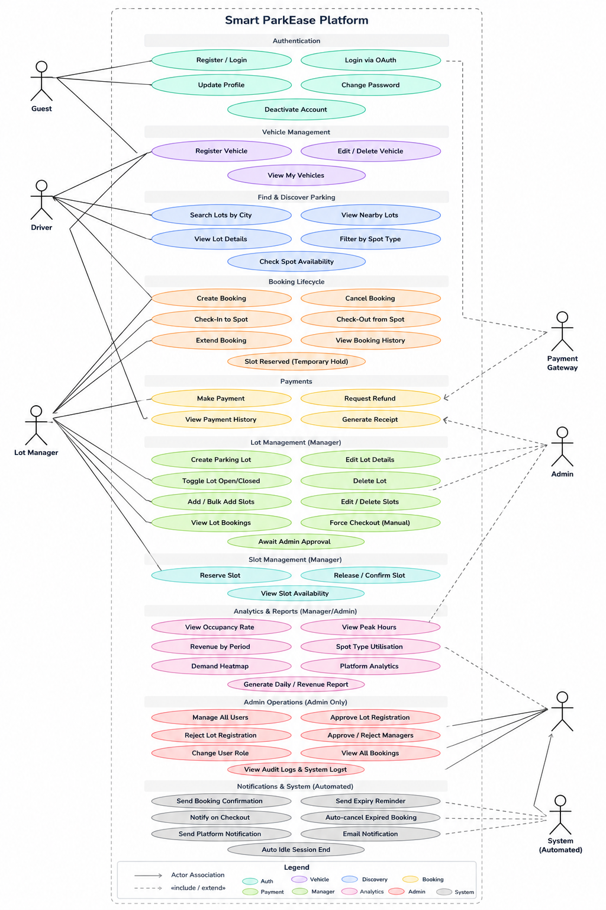
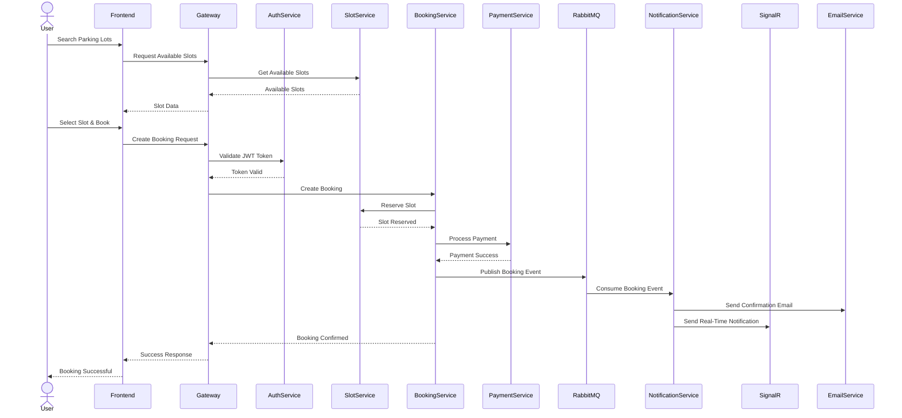
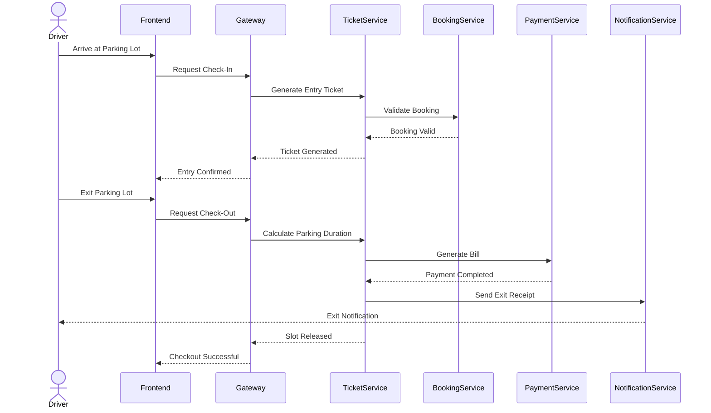
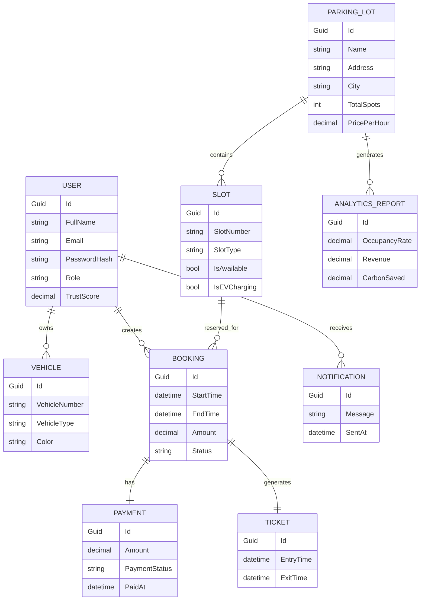

# 🚗 ParkEase — Smart Parking Ecosystem

<p align="center">
  
  
  
  
  
</p>

---

<p align="center">
  
</p>

---

# 📌 Overview

ParkEase is a scalable Smart Parking Management Platform designed using modern distributed system principles.

The platform enables:

- Real-time parking slot discovery
- Slot booking & reservation
- Vehicle entry and exit management
- Secure online payments
- Real-time notifications
- Parking lot management
- Analytics & operational intelligence
- Intelligent smart-city parking workflows

---

# ✨ What Makes ParkEase Different

ParkEase is not just a parking booking application.

It introduces intelligent operational features including:

- Trust Score Engine
- Silent Demand Heatmap
- Carbon Savings Dashboard
- Memory Parking Recall
- Behavioral Parking Analytics

These features transform the platform from a CRUD system into a smart mobility infrastructure backend.

---

# 🌐 Live Deployment Links

## Frontend

```text
https://parkease-lemon.vercel.app
```

## Backend Gateway

```text
https://parkease-api-gateway-aigx.onrender.com
```

## Swagger API Documentation

```text
https://parkease-api-gateway-aigx.onrender.com/swagger/index.html
```

---

# 🏗️ Architecture Style

The system follows:

- Microservices Architecture
- Clean Architecture
- Event-Driven Communication
- Database-per-Service Pattern
- API Gateway Pattern

---

# 🛠️ Tech Stack

| Layer | Technology |
|---|---|
| Frontend | Angular |
| Backend | ASP.NET Core Web API |
| Database | PostgreSQL |
| ORM | Entity Framework Core |
| Authentication | JWT + Google OAuth |
| API Gateway | YARP |
| Messaging | RabbitMQ |
| Caching | Redis |
| Real-Time Communication | SignalR |
| Containerization | Docker |
| Documentation | Swagger |

---

# 🧩 Microservices

| Service | Responsibility |
|---|---|
| Auth Service | Authentication & Authorization |
| ParkingLot Service | Parking lot operations |
| Spot Service | Parking slot management |
| Booking Service | Booking workflows |
| Vehicle Service | Vehicle management |
| Payment Service | Payment processing |
| Notification Service | Notifications & alerts |
| Analytics Service | Reports & platform intelligence |
| API Gateway | Request routing |

---

# 🖥️ Frontend Features

The Angular frontend includes:

- Animated Landing Page
- Driver Dashboard
- Manager Dashboard
- Admin Dashboard
- Real-Time Notifications
- Booking Flow UI
- Vehicle Tracking
- Route Guards
- Shared Component Architecture
- Responsive Design

---

# 📂 Frontend Structure

```bash
frontend/
│
├── src/
│   ├── app/
│   │
│   ├── core/
│   │   ├── guards/
│   │   ├── interceptors/
│   │   ├── models/
│   │   └── services/
│   │
│   ├── features/
│   │   ├── auth/
│   │   ├── driver/
│   │   ├── manager/
│   │   ├── admin/
│   │   └── landing/
│   │
│   ├── shared/
│   │   ├── components/
│   │   ├── dialogs/
│   │   └── shared.module.ts
│   │
│   ├── environments/
│   │
│   ├── app-routing.module.ts
│   ├── app.module.ts
│   └── styles.scss
│
├── angular.json
├── package.json
└── vercel.json
```

---

# ⚙️ Backend Structure

```bash
backend/
│
├── gateway/
│   └── api-gateway/
│
├── buildingblocks/
│   ├── contracts/
│   ├── events/
│   ├── infrastructure/
│   └── shared/
│
└── services/
    ├── auth-service/
    ├── parkinglot-service/
    ├── spot-service/
    ├── booking-service/
    ├── vehicle-service/
    ├── payment-service/
    ├── notification-service/
    └── analytics-service/
```

---

# 🧱 Clean Architecture

Each service follows layered architecture.

```bash
Service/
│
├── API/
├── Application/
├── Domain/
├── Infrastructure/
└── Tests/
```

---

# 👥 User Roles

## Driver

Drivers can:

- Search parking lots
- Book parking slots
- Extend bookings
- Cancel reservations
- View booking history
- Track vehicles
- Receive notifications

---

## Parking Manager

Managers can:

- Create parking lots
- Manage parking slots
- Monitor bookings
- View revenue reports
- Manage operations

---

## Admin

Admins can:

- Manage users
- Approve managers
- Access analytics
- Monitor logs
- Control platform activity

---

# 🅿️ Slot Categories

| Slot Type |
|---|
| Compact |
| Standard |
| Large |
| EV Charging |
| Handicapped |

---

# 🔐 Authentication Features

- JWT Authentication
- Role-Based Authorization
- Google OAuth Login
- Password Encryption
- Secure Protected APIs

---

# 🎯 UML Use Case Diagram

<p align="center">
  
</p>

---

# 🔄 Booking Sequence Diagram



---

# 🚗 Vehicle Entry & Exit Sequence Diagram



---

# 🗄️ Database ER Diagram



---

# 🏗️ High-Level Architecture Diagram

```text
                           ┌──────────────────────┐
                           │   Angular Frontend   │
                           └──────────┬───────────┘
                                      │
                                      ▼
                           ┌──────────────────────┐
                           │     API Gateway      │
                           │  YARP Reverse Proxy  │
                           └──────────┬───────────┘

        ┌─────────────────────────────┼─────────────────────────────┐
        ▼                             ▼                             ▼

 ┌───────────────┐          ┌────────────────┐          ┌────────────────┐
 │ Auth Service  │          │ Booking Service│          │ Payment Service│
 └──────┬────────┘          └──────┬─────────┘          └──────┬─────────┘
        ▼                          ▼                           ▼
  PostgreSQL DB              PostgreSQL DB               PostgreSQL DB


 ┌───────────────┐          ┌────────────────┐          ┌────────────────┐
 │ Spot Service  │          │ Vehicle Service│          │ Analytics Svc  │
 └──────┬────────┘          └──────┬─────────┘          └──────┬─────────┘
        ▼                          ▼                           ▼
  PostgreSQL DB              PostgreSQL DB               PostgreSQL DB


                 ┌────────────────────────────────┐
                 │ Notification Service           │
                 │ SignalR + RabbitMQ Consumers   │
                 └────────────────────────────────┘
```

---

# 🚘 Booking Workflow

```text
Search Parking Lot
        ↓
View Available Slots
        ↓
Select Slot
        ↓
Create Booking
        ↓
Payment Processing
        ↓
RabbitMQ Event Published
        ↓
Notification Service Triggered
        ↓
Booking Confirmed
```

---

# 🚗 Vehicle Entry Workflow

```text
Vehicle Arrives
      ↓
Generate Ticket
      ↓
Assign Slot
      ↓
Store Entry Time
```

---

# 🚙 Vehicle Exit Workflow

```text
Vehicle Exit
      ↓
Calculate Duration
      ↓
Generate Bill
      ↓
Process Payment
      ↓
Release Slot
```

---

# ⚡ Redis Caching

Redis is used for:

- Faster API responses
- Slot availability caching
- Frequently accessed parking data

---

# 📨 RabbitMQ Event Communication

RabbitMQ enables asynchronous communication between services.

### Example Event Flow

```text
Booking Created
      ↓
Event Published
      ↓
Notification Service Consumes Event
      ↓
SignalR + Email Notification Sent
```

---

# 🌐 API Gateway

YARP API Gateway handles:

- Request Routing
- Authentication Validation
- Load Balancing
- Service Aggregation

---

# 🗄️ Main Database Entities

- Users
- Vehicles
- ParkingLots
- ParkingSpots
- Bookings
- Payments
- Tickets
- Notifications
- AnalyticsReports

---

# 🌟 Intelligent Features

## Trust Score Engine

User reputation system based on:

- cancellations
- overstays
- no-shows
- payment discipline
- timely exits

---

## Carbon Savings Dashboard

Tracks estimated CO₂ reduction through optimized parking discovery.

---

## Memory Parking Recall

Stores:

- floor
- section
- slot number
- parking location memory

---

## Silent Demand Heatmap

Analyzes:

- failed searches
- unavailable zones
- unmet demand
- peak load areas

---

# 📡 Important APIs

## Authentication APIs

| Method | Endpoint |
|---|---|
| POST | `/api/auth/register` |
| POST | `/api/auth/login` |
| POST | `/api/auth/google-login` |

---

## Parking APIs

| Method | Endpoint |
|---|---|
| GET | `/api/parkinglots` |
| POST | `/api/parkinglots` |
| PUT | `/api/parkinglots/{id}` |

---

## Booking APIs

| Method | Endpoint |
|---|---|
| POST | `/api/bookings` |
| PUT | `/api/bookings/extend` |
| DELETE | `/api/bookings/cancel` |

---

# 🐳 Docker Support

Run complete system:

```bash
docker-compose up --build
```

---

# ▶️ Running Frontend

```bash
cd frontend
npm install
ng serve
```

Frontend URL:

```text
http://localhost:4200
```

---

# ▶️ Running Backend Services

Example:

```bash
cd backend/services/auth-service
dotnet run
```

---

# 📘 Swagger Documentation

Swagger is enabled for all microservices.

Example:

```text
http://localhost:5001/swagger
```

---

# 📈 Future Enhancements

- AI-based parking prediction
- Dynamic pricing engine
- IoT parking sensors
- License plate recognition
- Mobile application support
- Smart traffic analytics
- Predictive occupancy analysis

---

# 🎯 Goals & Objectives

## Business Goals

- Reduce parking search time
- Improve parking lot utilization
- Build scalable smart-city infrastructure
- Provide secure digital parking ecosystem

## Engineering Goals

- Independent service deployment
- Scalable architecture
- Fault isolation
- Fast geo-search responses
- Distributed communication

---

# ⚠️ Engineering Challenges

- Double booking prevention
- Distributed transaction consistency
- Cross-service communication
- Notification reliability
- High concurrency booking safety

---

# 📖 Glossary

| Term | Meaning |
|---|---|
| Driver | End user booking parking |
| Manager | Parking lot operator |
| JWT | JSON Web Token |
| Slot | Individual parking unit |
| Booking | Reserved parking session |
| SignalR | Real-time communication framework |
| RabbitMQ | Event messaging broker |

---

# 📚 References

- ASP.NET Core Documentation
- Angular Official Documentation
- PostgreSQL Documentation
- Docker Documentation
- RabbitMQ Documentation
- Redis Documentation
- Swagger OpenAPI Specification
- OWASP API Security Top 10

Project concepts and documentation were also inspired by the ParkEase internal case study and planning documents. :contentReference[oaicite:0]{index=0}

---

# 📑 Bibliography

1. Microsoft — ASP.NET Core Documentation  
2. Microsoft — Entity Framework Core Documentation  
3. PostgreSQL Global Development Group — PostgreSQL Docs  
4. Docker Inc. — Docker Documentation  
5. OpenAPI Initiative — OpenAPI Specification  
6. OWASP Foundation — API Security Top 10  
7. Martin Fowler — *Microservices Architecture*  
8. Sam Newman — *Building Microservices*  
9. Angular Official Documentation  
10. Redis Official Documentation  
11. RabbitMQ Official Documentation  

---

# 👨‍💻 Contributors

- Ananya Shukla
- Team ParkEase

---

# 📜 License

This project is developed for educational and academic purposes.

---

# ⭐ Final Statement

> ParkEase is not just a parking application.  
> It is a scalable intelligent mobility infrastructure platform built using modern distributed systems engineering.
